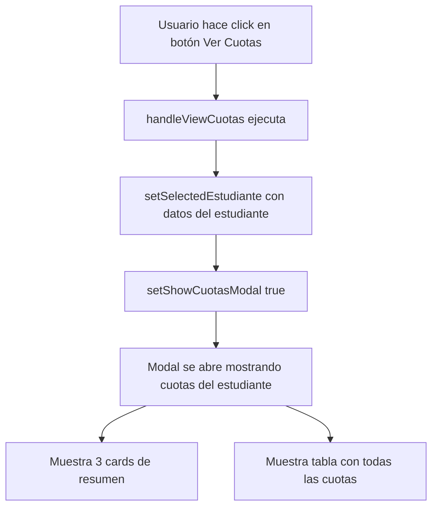
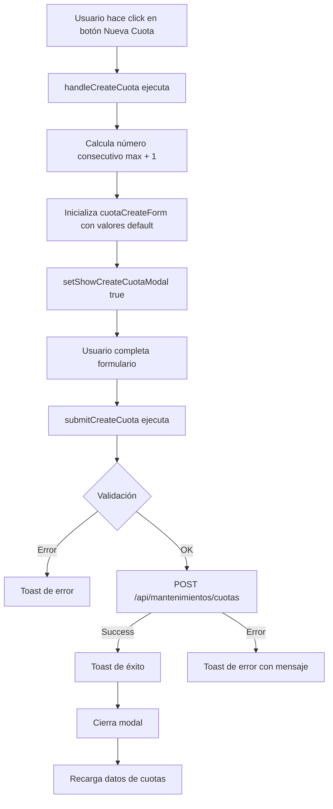
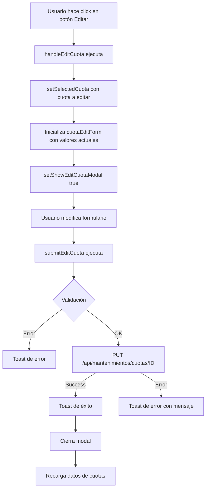
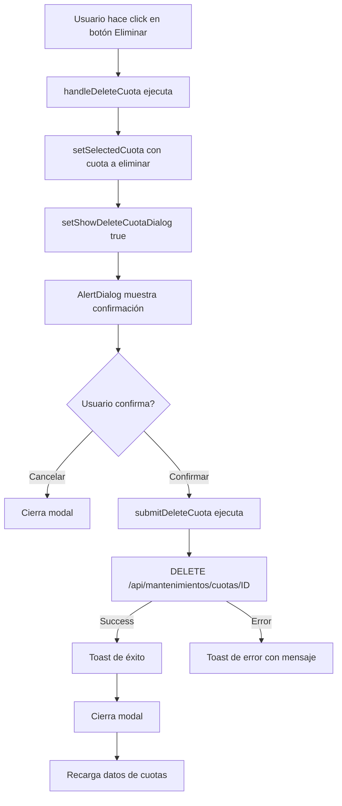

# Implementación CRUD de Cuotas en Reportes Financieros

## Índice
1. [Descripción General](#descripción-general)
2. [Estructura del Componente](#estructura-del-componente)
3. [Gestión de Estado](#gestión-de-estado)
4. [Flujos de Operaciones CRUD](#flujos-de-operaciones-crud)
5. [Integración con API](#integración-con-api)
6. [Jerarquía de Modales](#jerarquía-de-modales)
7. [Manejo de Errores](#manejo-de-errores)
8. [Mantenimiento](#mantenimiento)

---

## Descripción General

Este documento detalla la implementación completa del sistema CRUD (Crear, Leer, Actualizar, Eliminar) para gestionar **cuotas de estudiantes** dentro del componente `reportes-financieros.tsx`.

### Ubicación del Código
- **Componente Principal**: `components/finanzas/reportes-financieros.tsx` (2358 líneas)
- **Servicios API**: `services/mantenimientos.ts`
- **Pestaña UI**: "Cuotas" → Tabla "Seguimiento por estudiante"

### Funcionalidades Principales
- ✅ Ver todas las cuotas de un estudiante con resumen visual (cards)
- ✅ Crear nuevas cuotas con cálculo automático del número consecutivo
- ✅ Editar cuotas existentes (incluidas las pagadas)
- ✅ Eliminar cuotas con confirmación (incluidas las pagadas)
- ✅ Actualización automática de datos tras cada operación

---

## Estructura del Componente

### Organización del Archivo

```
reportes-financieros.tsx
├── Imports (líneas 1-45)
│   ├── React hooks: useState, useEffect, useMemo, useCallback
│   ├── UI Components: Dialog, Button, Table, Card, Badge, Select, Input, Label, AlertDialog, Tabs, Textarea
│   ├── Icons: Eye, Loader2, Pencil, Plus, RefreshCw, Trash2
│   ├── Services: getCuotasDashboard, createCuota, updateCuota, deleteCuota
│   └── Types: CuotaCreatePayload, CuotaUpdatePayload, CuotasDashboardEstudiante, CuotaDetalladaResumen
│
├── Estado del Componente (líneas ~330-360)
│   ├── Estados para modales de cuotas
│   ├── Estados para formularios
│   └── Estudiante y cuota seleccionados
│
├── Handlers CRUD (líneas ~680-780)
│   ├── handleViewCuotas()
│   ├── handleCreateCuota()
│   ├── submitCreateCuota()
│   ├── handleEditCuota()
│   ├── submitEditCuota()
│   ├── handleDeleteCuota()
│   └── submitDeleteCuota()
│
├── UI - Tabla de Seguimiento (líneas ~1440-1520)
│   └── Columna "Acciones" con botón "Ver Cuotas"
│
├── Modales (líneas ~1580-1850)
│   ├── Modal de Visualización (lista de cuotas)
│   ├── Modal de Creación (formulario nuevo)
│   ├── Modal de Edición (formulario existente)
│   └── AlertDialog de Eliminación (confirmación)
│
└── Return con Tabs y TabsContent
```

### Dependencias Clave

```typescript
// UI Components
import { Dialog, DialogContent, DialogDescription, DialogFooter, DialogHeader, DialogTitle } from "@/components/ui/dialog"
import { Button } from "@/components/ui/button"
import { Table, TableBody, TableCell, TableHead, TableHeader, TableRow } from "@/components/ui/table"
import { Card, CardContent, CardHeader, CardTitle } from "@/components/ui/card"
import { Badge } from "@/components/ui/badge"
import { Select, SelectContent, SelectItem, SelectTrigger, SelectValue } from "@/components/ui/select"
import { Input } from "@/components/ui/input"
import { Label } from "@/components/ui/label"
import { AlertDialog, AlertDialogAction, AlertDialogCancel, AlertDialogContent, AlertDialogDescription, AlertDialogFooter, AlertDialogHeader, AlertDialogTitle } from "@/components/ui/alert-dialog"
import { Tabs, TabsContent, TabsList, TabsTrigger } from "@/components/ui/tabs"
import { Textarea } from "@/components/ui/textarea"

// API Services
import { getCuotasDashboard, createCuota, updateCuota, deleteCuota } from "@/services/mantenimientos"
import type { CuotaCreatePayload, CuotaUpdatePayload, CuotasDashboardEstudiante, CuotaDetalladaResumen } from "@/services/mantenimientos"

// Icons
import { Eye, Loader2, Pencil, Plus, RefreshCw, Trash2 } from "lucide-react"

// Notifications
import { toast } from "sonner"
```

---

## Gestión de Estado

### Estados para Modales y Selección

```typescript
// Control de modales
const [showCuotasModal, setShowCuotasModal] = useState(false)
const [showCreateCuotaModal, setShowCreateCuotaModal] = useState(false)
const [showEditCuotaModal, setShowEditCuotaModal] = useState(false)
const [showDeleteCuotaDialog, setShowDeleteCuotaDialog] = useState(false)

// Entidades seleccionadas
const [selectedEstudiante, setSelectedEstudiante] = useState<CuotasDashboardEstudiante | null>(null)
const [selectedCuota, setSelectedCuota] = useState<CuotaDetalladaResumen | null>(null)
```

### Estados para Formularios

#### Formulario de Creación
```typescript
const [cuotaCreateForm, setCuotaCreateForm] = useState({
  numero_cuota: 1,
  fecha_vencimiento: '',
  monto: 0,
  estado: 'pendiente',
  observaciones: ''
})
```

**Campos:**
- `numero_cuota` (number, required): Se calcula automáticamente como max + 1
- `fecha_vencimiento` (string, required): Formato YYYY-MM-DD
- `monto` (number, required): Cantidad decimal (0.01 step)
- `estado` (string, required): 'pendiente' | 'pagado' | 'vencido' | 'parcial'
- `observaciones` (string, optional): Notas adicionales

#### Formulario de Edición
```typescript
const [cuotaEditForm, setCuotaEditForm] = useState({
  numero_cuota: 1,
  fecha_vencimiento: '',
  monto: 0,
  estado: 'pendiente'
})
```

**Nota:** El formulario de edición NO incluye `observaciones` para mantener las existentes.

---

## Flujos de Operaciones CRUD

### 1. Lectura (Read) - Ver Cuotas

#### Flujo de Ejecución


#### Código del Handler
```typescript
const handleViewCuotas = (estudiante: CuotasDashboardEstudiante) => {
  setSelectedEstudiante(estudiante)
  setShowCuotasModal(true)
}
```

#### Botón de Activación
```tsx
<Button 
  variant="outline" 
  size="sm" 
  onClick={() => handleViewCuotas(estudiante)}
>
  <Eye className="h-4 w-4 mr-1" />
  Ver Cuotas
</Button>
```

---

### 2. Creación (Create) - Nueva Cuota

#### Flujo de Ejecución


#### Código del Handler de Apertura
```typescript
const handleCreateCuota = () => {
  if (!selectedEstudiante) return
  
  // Calcular el siguiente número de cuota
  const maxCuota = selectedEstudiante.cuotas.reduce(
    (max, c) => Math.max(max, c.numero_cuota), 
    0
  )
  
  setCuotaCreateForm({
    numero_cuota: maxCuota + 1,
    fecha_vencimiento: '',
    monto: 0,
    estado: 'pendiente',
    observaciones: ''
  })
  
  setShowCreateCuotaModal(true)
}
```

#### Código del Handler de Envío
```typescript
const submitCreateCuota = async () => {
  if (!selectedEstudiante) return
  
  try {
    const payload: CuotaCreatePayload = {
      estudiante_programa_id: selectedEstudiante.estudiante_programa_id,
      numero_cuota: cuotaCreateForm.numero_cuota,
      fecha_vencimiento: cuotaCreateForm.fecha_vencimiento,
      monto: cuotaCreateForm.monto,
      estado: cuotaCreateForm.estado,
      ...(cuotaCreateForm.observaciones && { 
        observaciones: cuotaCreateForm.observaciones 
      })
    }
    
    await createCuota(payload)
    toast.success('Cuota creada exitosamente')
    setShowCreateCuotaModal(false)
    
    // Recargar datos
    loadCuotasData()
  } catch (error) {
    console.error('Error al crear cuota:', error)
    toast.error('Error al crear la cuota')
  }
}
```

#### Endpoint Consumido
```
POST /api/mantenimientos/cuotas
Content-Type: application/json

{
  "estudiante_programa_id": 123,
  "numero_cuota": 5,
  "fecha_vencimiento": "2024-12-31",
  "monto": 1500.00,
  "estado": "pendiente",
  "observaciones": "Cuota de diciembre"
}
```

---

### 3. Actualización (Update) - Editar Cuota

#### Flujo de Ejecución


#### Código del Handler de Apertura
```typescript
const handleEditCuota = (cuota: CuotaDetalladaResumen) => {
  setSelectedCuota(cuota)
  setCuotaEditForm({
    numero_cuota: cuota.numero_cuota,
    fecha_vencimiento: cuota.fecha_vencimiento,
    monto: parseFloat(cuota.monto.toString()),
    estado: cuota.estado
  })
  setShowEditCuotaModal(true)
}
```

#### Código del Handler de Envío
```typescript
const submitEditCuota = async () => {
  if (!selectedCuota) return
  
  try {
    const payload: CuotaUpdatePayload = {
      numero_cuota: cuotaEditForm.numero_cuota,
      fecha_vencimiento: cuotaEditForm.fecha_vencimiento,
      monto: cuotaEditForm.monto,
      estado: cuotaEditForm.estado
    }
    
    await updateCuota(selectedCuota.id, payload)
    toast.success('Cuota actualizada exitosamente')
    setShowEditCuotaModal(false)
    setSelectedCuota(null)
    
    // Recargar datos
    loadCuotasData()
  } catch (error) {
    console.error('Error al actualizar cuota:', error)
    toast.error('Error al actualizar la cuota')
  }
}
```

#### Endpoint Consumido
```
PUT /api/mantenimientos/cuotas/456
Content-Type: application/json

{
  "numero_cuota": 5,
  "fecha_vencimiento": "2024-12-31",
  "monto": 1600.00,
  "estado": "pagado"
}
```

---

### 4. Eliminación (Delete) - Borrar Cuota

#### Flujo de Ejecución


#### Código del Handler de Apertura
```typescript
const handleDeleteCuota = (cuota: CuotaDetalladaResumen) => {
  setSelectedCuota(cuota)
  setShowDeleteCuotaDialog(true)
}
```

#### Código del Handler de Confirmación
```typescript
const submitDeleteCuota = async () => {
  if (!selectedCuota) return
  
  try {
    await deleteCuota(selectedCuota.id)
    toast.success('Cuota eliminada exitosamente')
    setShowDeleteCuotaDialog(false)
    setSelectedCuota(null)
    
    // Recargar datos
    loadCuotasData()
  } catch (error) {
    console.error('Error al eliminar cuota:', error)
    toast.error('Error al eliminar la cuota')
  }
}
```

#### Endpoint Consumido
```
DELETE /api/mantenimientos/cuotas/456
```

**⚠️ IMPORTANTE:** La eliminación es en cascada. Al eliminar una cuota también se eliminan:
- Registros de `kardex_pagos` relacionados
- Registros de `reconciliation_records` relacionados

---

## Integración con API

### Servicio `mantenimientos.ts`

#### Función: `createCuota`
```typescript
export async function createCuota(payload: CuotaCreatePayload): Promise<any> {
  const response = await api.post('/mantenimientos/cuotas', payload)
  return response.data
}
```

#### Función: `updateCuota`
```typescript
export async function updateCuota(id: number, payload: CuotaUpdatePayload): Promise<any> {
  const response = await api.put(`/mantenimientos/cuotas/${id}`, payload)
  return response.data
}
```

#### Función: `deleteCuota`
```typescript
export async function deleteCuota(id: number): Promise<any> {
  const response = await api.delete(`/mantenimientos/cuotas/${id}`)
  return response.data
}
```

#### Función: `getCuotasDashboard`
```typescript
export async function getCuotasDashboard(params: CuotasDashboardParams): Promise<CuotasDashboardResponse> {
  const response = await api.get('/mantenimientos/cuotas/dashboard', { params })
  return response.data
}
```

### Interfaces TypeScript

#### `CuotaCreatePayload`
```typescript
export interface CuotaCreatePayload {
  estudiante_programa_id: number
  numero_cuota: number
  fecha_vencimiento: string
  monto: number
  estado?: string
  observaciones?: string
}
```

#### `CuotaUpdatePayload`
```typescript
export interface CuotaUpdatePayload {
  numero_cuota?: number
  fecha_vencimiento?: string
  monto?: number
  estado?: string
}
```

#### `CuotaDetalladaResumen`
```typescript
export interface CuotaDetalladaResumen {
  id: number
  numero_cuota: number
  monto: string
  monto_pagado: string
  saldo: string
  fecha_vencimiento: string
  fecha_pago: string | null
  estado: string
  observaciones: string | null
  metodo_pago: string | null
  kardex_pagos: Array<{
    id: number
    cuota_id: number
    monto: string
    fecha_pago: string
    metodo_pago: string
  }>
}
```

#### `CuotasDashboardEstudiante`
```typescript
export interface CuotasDashboardEstudiante {
  estudiante_programa_id: number
  prospecto: {
    id: number
    nombre: string
    apellido_paterno: string
    apellido_materno: string | null
    email: string
  }
  programa: {
    id: number
    nombre: string
  }
  cuotas: CuotaDetalladaResumen[]
  total_cuotas: number
  total_monto: string
  total_pagado: string
  saldo_pendiente: string
}
```

---

## Jerarquía de Modales

### 1. Modal de Visualización (Principal)
```tsx
<Dialog open={showCuotasModal} onOpenChange={setShowCuotasModal}>
  <DialogContent className="max-w-6xl max-h-[80vh] overflow-auto">
    <DialogHeader>
      <DialogTitle>Cuotas de {selectedEstudiante?.prospecto?.nombre}</DialogTitle>
    </DialogHeader>
    
    {/* Cards de resumen */}
    <div className="grid grid-cols-3 gap-4">
      <Card><CardContent>Total Cuotas: {selectedEstudiante?.total_cuotas}</CardContent></Card>
      <Card><CardContent>Total Pagado: ${selectedEstudiante?.total_pagado}</CardContent></Card>
      <Card><CardContent>Saldo Pendiente: ${selectedEstudiante?.saldo_pendiente}</CardContent></Card>
    </div>
    
    {/* Botón Nueva Cuota */}
    <Button onClick={handleCreateCuota}>
      <Plus className="h-4 w-4 mr-2" />
      Nueva Cuota
    </Button>
    
    {/* Tabla de cuotas */}
    <Table>
      {/* ... filas con botones Editar y Eliminar */}
    </Table>
    
    <DialogFooter>
      <Button variant="outline" onClick={() => setShowCuotasModal(false)}>
        Cerrar
      </Button>
    </DialogFooter>
  </DialogContent>
</Dialog>
```

### 2. Modal de Creación (Hijo)
```tsx
<Dialog open={showCreateCuotaModal} onOpenChange={setShowCreateCuotaModal}>
  <DialogContent>
    <DialogHeader>
      <DialogTitle>Crear Nueva Cuota</DialogTitle>
    </DialogHeader>
    
    <div className="space-y-4">
      <div><Label>Número de Cuota</Label><Input type="number" /></div>
      <div><Label>Fecha de Vencimiento</Label><Input type="date" /></div>
      <div><Label>Monto</Label><Input type="number" step="0.01" /></div>
      <div><Label>Estado</Label><Select>...</Select></div>
      <div><Label>Observaciones</Label><Textarea /></div>
    </div>
    
    <DialogFooter>
      <Button variant="outline" onClick={() => setShowCreateCuotaModal(false)}>
        Cancelar
      </Button>
      <Button onClick={submitCreateCuota}>Crear Cuota</Button>
    </DialogFooter>
  </DialogContent>
</Dialog>
```

### 3. Modal de Edición (Hijo)
```tsx
<Dialog open={showEditCuotaModal} onOpenChange={setShowEditCuotaModal}>
  <DialogContent>
    <DialogHeader>
      <DialogTitle>Editar Cuota #{selectedCuota?.numero_cuota}</DialogTitle>
    </DialogHeader>
    
    <div className="space-y-4">
      <div><Label>Número de Cuota</Label><Input type="number" /></div>
      <div><Label>Fecha de Vencimiento</Label><Input type="date" /></div>
      <div><Label>Monto</Label><Input type="number" step="0.01" /></div>
      <div><Label>Estado</Label><Select>...</Select></div>
    </div>
    
    <DialogFooter>
      <Button variant="outline" onClick={() => setShowEditCuotaModal(false)}>
        Cancelar
      </Button>
      <Button onClick={submitEditCuota}>Guardar Cambios</Button>
    </DialogFooter>
  </DialogContent>
</Dialog>
```

### 4. AlertDialog de Eliminación (Hijo)
```tsx
<AlertDialog open={showDeleteCuotaDialog} onOpenChange={setShowDeleteCuotaDialog}>
  <AlertDialogContent>
    <AlertDialogHeader>
      <AlertDialogTitle>¿Eliminar cuota #{selectedCuota?.numero_cuota}?</AlertDialogTitle>
      <AlertDialogDescription>
        Esta acción no se puede deshacer. Se eliminarán también los registros relacionados.
      </AlertDialogDescription>
    </AlertDialogHeader>
    <AlertDialogFooter>
      <AlertDialogCancel>Cancelar</AlertDialogCancel>
      <AlertDialogAction onClick={submitDeleteCuota}>Eliminar</AlertDialogAction>
    </AlertDialogFooter>
  </AlertDialogContent>
</AlertDialog>
```

---

## Manejo de Errores

### Estrategia General
- **Try-Catch**: Todos los handlers async usan try-catch
- **Toast Notifications**: Mensajes de éxito/error al usuario
- **Console Logging**: Errores se registran en consola para debugging
- **Validaciones**: Checks de `selectedEstudiante` y `selectedCuota` antes de operar

### Ejemplos de Validación

```typescript
// Validación antes de crear
const submitCreateCuota = async () => {
  if (!selectedEstudiante) return  // Salida temprana si no hay estudiante
  
  try {
    // ... código de creación
  } catch (error) {
    console.error('Error al crear cuota:', error)
    toast.error('Error al crear la cuota')
  }
}

// Validación antes de editar
const submitEditCuota = async () => {
  if (!selectedCuota) return  // Salida temprana si no hay cuota seleccionada
  
  try {
    // ... código de edición
  } catch (error) {
    console.error('Error al actualizar cuota:', error)
    toast.error('Error al actualizar la cuota')
  }
}
```

### Mensajes de Error Estándar
| Operación | Mensaje de Éxito | Mensaje de Error |
|-----------|------------------|------------------|
| Crear | "Cuota creada exitosamente" | "Error al crear la cuota" |
| Editar | "Cuota actualizada exitosamente" | "Error al actualizar la cuota" |
| Eliminar | "Cuota eliminada exitosamente" | "Error al eliminar la cuota" |

---

## Mantenimiento

### Puntos de Extensión

#### 1. Agregar Campos al Formulario
Para agregar un nuevo campo (ej: `descuento`):

```typescript
// 1. Actualizar interfaces en services/mantenimientos.ts
export interface CuotaCreatePayload {
  // ... campos existentes
  descuento?: number  // Nuevo campo
}

// 2. Actualizar estado del formulario
const [cuotaCreateForm, setCuotaCreateForm] = useState({
  // ... campos existentes
  descuento: 0  // Nuevo campo
})

// 3. Agregar input en el modal
<div>
  <Label>Descuento</Label>
  <Input
    type="number"
    step="0.01"
    value={cuotaCreateForm.descuento}
    onChange={(e) => setCuotaCreateForm({ 
      ...cuotaCreateForm, 
      descuento: parseFloat(e.target.value) || 0 
    })}
  />
</div>

// 4. Incluir en payload de envío
const payload: CuotaCreatePayload = {
  // ... campos existentes
  ...(cuotaCreateForm.descuento && { descuento: cuotaCreateForm.descuento })
}
```

#### 2. Modificar Validaciones
Para agregar validaciones personalizadas:

```typescript
const submitCreateCuota = async () => {
  if (!selectedEstudiante) return
  
  // Validación personalizada: monto mínimo
  if (cuotaCreateForm.monto < 100) {
    toast.error('El monto debe ser al menos $100')
    return
  }
  
  // Validación personalizada: fecha futura
  const today = new Date().toISOString().split('T')[0]
  if (cuotaCreateForm.fecha_vencimiento < today) {
    toast.error('La fecha de vencimiento debe ser futura')
    return
  }
  
  try {
    // ... resto del código
  } catch (error) {
    // ...
  }
}
```

#### 3. Agregar Estados Personalizados
Para agregar nuevos estados de cuota:

```tsx
<Select value={cuotaCreateForm.estado} onValueChange={(value) => setCuotaCreateForm({ ...cuotaCreateForm, estado: value })}>
  <SelectTrigger>
    <SelectValue />
  </SelectTrigger>
  <SelectContent>
    <SelectItem value="pendiente">Pendiente</SelectItem>
    <SelectItem value="pagado">Pagado</SelectItem>
    <SelectItem value="vencido">Vencido</SelectItem>
    <SelectItem value="parcial">Pago Parcial</SelectItem>
    {/* Nuevos estados */}
    <SelectItem value="condonado">Condonado</SelectItem>
    <SelectItem value="refinanciado">Refinanciado</SelectItem>
  </SelectContent>
</Select>
```

### Checklist de Testing

Antes de desplegar cambios, verificar:

- [ ] ✅ Botón "Ver Cuotas" abre el modal correctamente
- [ ] ✅ Cards de resumen muestran valores correctos
- [ ] ✅ Botón "Nueva Cuota" calcula el número consecutivo correctamente
- [ ] ✅ Formulario de creación valida campos requeridos
- [ ] ✅ POST /api/mantenimientos/cuotas se ejecuta correctamente
- [ ] ✅ Toast de éxito se muestra tras crear
- [ ] ✅ Datos se recargan automáticamente tras crear
- [ ] ✅ Botón "Editar" carga valores actuales en el formulario
- [ ] ✅ PUT /api/mantenimientos/cuotas/{id} se ejecuta correctamente
- [ ] ✅ Toast de éxito se muestra tras editar
- [ ] ✅ Botón "Eliminar" muestra confirmación
- [ ] ✅ DELETE /api/mantenimientos/cuotas/{id} se ejecuta correctamente
- [ ] ✅ Toast de éxito se muestra tras eliminar
- [ ] ✅ Cuotas pagadas pueden editarse y eliminarse
- [ ] ✅ Validaciones de frontend funcionan correctamente
- [ ] ✅ Errores de backend se muestran con toast

### Archivos Relacionados

Para modificar esta funcionalidad, revisar:

1. `components/finanzas/reportes-financieros.tsx` - Componente principal
2. `services/mantenimientos.ts` - Funciones de API
3. `components/ui/dialog.tsx` - Componente Dialog
4. `components/ui/alert-dialog.tsx` - Componente AlertDialog
5. `components/ui/input.tsx` - Componente Input
6. `components/ui/select.tsx` - Componente Select
7. `components/ui/textarea.tsx` - Componente Textarea
8. `components/finanzas/finanzas.md` - Documentación de API backend

### Convenciones de Código

- **Nomenclatura de Handlers**: `handle[Acción][Entidad]` (ej: `handleCreateCuota`)
- **Nomenclatura de Submit**: `submit[Acción][Entidad]` (ej: `submitCreateCuota`)
- **Estado de Formularios**: `[entidad][Acción]Form` (ej: `cuotaCreateForm`)
- **Estado de Modales**: `show[Nombre]Modal` o `show[Nombre]Dialog` (ej: `showCreateCuotaModal`)
- **Formato de Fechas**: YYYY-MM-DD (ISO 8601)
- **Formato de Montos**: Number con 2 decimales (step="0.01")

---

## Resumen Técnico

### Stack de Tecnologías
- **Framework**: Next.js 14+ con App Router
- **Lenguaje**: TypeScript
- **UI Library**: shadcn/ui + Radix UI
- **Estado**: React Hooks (useState, useEffect, useMemo, useCallback)
- **HTTP Client**: axios
- **Notificaciones**: sonner
- **Iconos**: lucide-react

### Endpoints Backend
| Método | Endpoint | Descripción |
|--------|----------|-------------|
| GET | `/api/mantenimientos/cuotas/dashboard` | Obtiene lista de estudiantes con sus cuotas |
| POST | `/api/mantenimientos/cuotas` | Crea una nueva cuota |
| PUT | `/api/mantenimientos/cuotas/{id}` | Actualiza una cuota existente |
| DELETE | `/api/mantenimientos/cuotas/{id}` | Elimina una cuota (cascade) |

### Líneas de Código por Sección
- **Imports**: ~45 líneas
- **Estado**: ~30 líneas
- **Handlers CRUD**: ~100 líneas
- **UI Tabla**: ~80 líneas
- **Modales**: ~270 líneas
- **Total añadido**: ~525 líneas

---

## Autor y Versión

- **Fecha de Implementación**: Enero 2025
- **Archivo**: `components/finanzas/reportes-financieros.tsx`
- **Versión del Componente**: 2.0 (con CRUD completo)
- **Documentación**: `docs/CUOTAS_CRUD_IMPLEMENTATION.md`

---

**Fin del documento**
