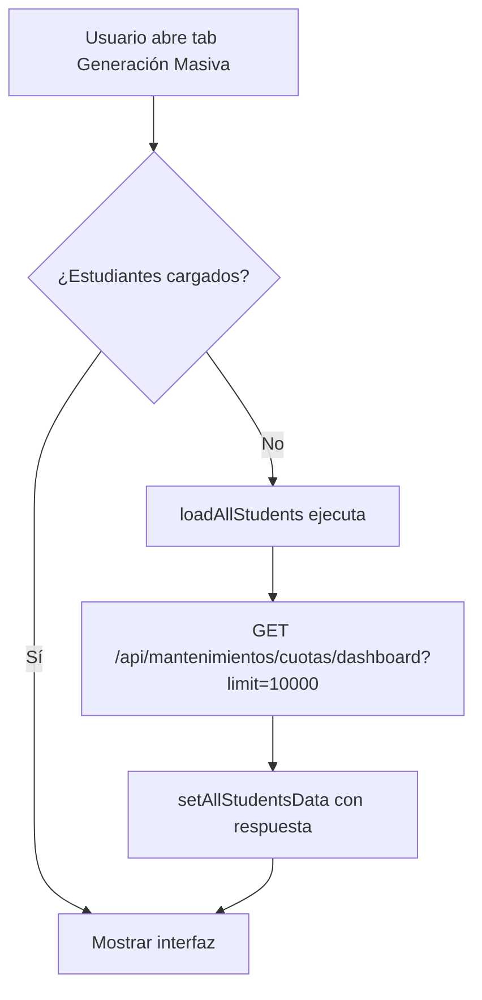
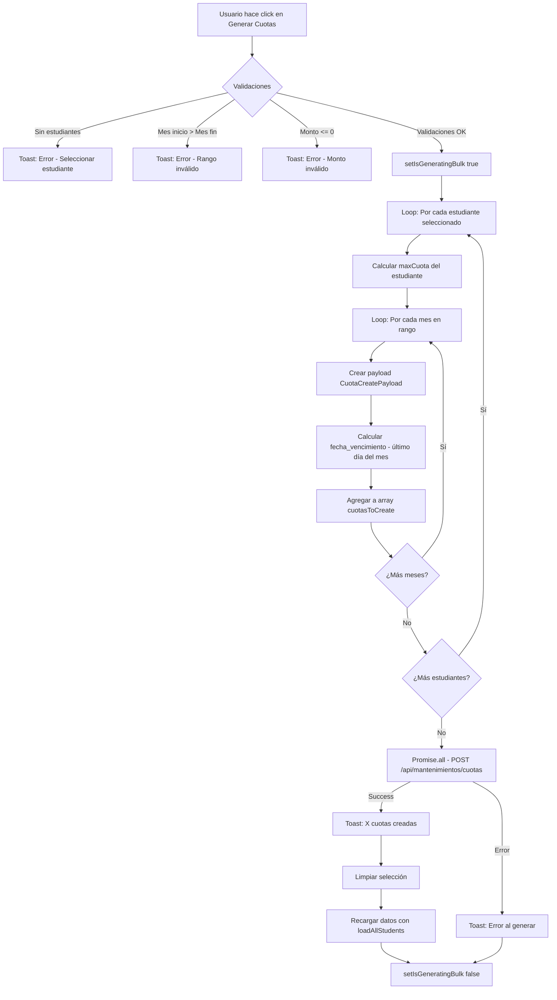

# Generación Masiva de Cuotas

## Descripción General

El tab "Generación Masiva" permite crear múltiples cuotas para uno o varios estudiantes de forma automática, configurando un rango de fechas por meses dentro de un año específico.

## Ubicación

**Componente**: `components/finanzas/reportes-financieros.tsx`  
**Tab**: "Generación Masiva" (4to tab después de Kardex, Conciliaciones, Cuotas)

---

## Funcionalidades Principales

### 1. **Configuración de Rango de Cuotas**
- ✅ Seleccionar año específico (2020-2050)
- ✅ Definir mes de inicio (Enero-Diciembre)
- ✅ Definir mes final (Enero-Diciembre)
- ✅ Establecer monto uniforme por mes
- ✅ Configurar estado inicial de las cuotas
- ✅ Agregar observaciones opcionales

### 2. **Selección de Estudiantes**
- ✅ Ver listado completo de todos los estudiantes con programas activos
- ✅ Selección individual mediante checkbox
- ✅ Selección masiva (todos/ninguno) con botón toggle
- ✅ Filtrado por nombre del estudiante
- ✅ Filtrado por número de carnet
- ✅ Información contextual: programa, cuotas actuales, saldo pendiente

### 3. **Generación Automática**
- ✅ Cálculo automático del número de cuota consecutivo por estudiante
- ✅ Fecha de vencimiento al último día de cada mes
- ✅ Creación en lote de todas las cuotas configuradas
- ✅ Feedback visual del proceso (loading state)
- ✅ Notificaciones de éxito/error

### 4. **Resumen en Tiempo Real**
- 📊 Estudiantes seleccionados
- 📊 Meses a generar
- 📊 Total de cuotas a crear
- 📊 Monto total acumulado

---

## Estructura de Estado

### Estados Principales

```typescript
// Filtros de búsqueda
const [bulkGenerationFilters, setBulkGenerationFilters] = useState({
  search: "",    // Filtro por nombre
  carnet: "",    // Filtro por carnet
})

// Estudiantes seleccionados (Set para mejor performance)
const [selectedStudents, setSelectedStudents] = useState<Set<number>>(new Set())

// Formulario de configuración
const [bulkCuotaForm, setBulkCuotaForm] = useState({
  anio: new Date().getFullYear(),  // Año actual por defecto
  mes_inicio: 1,                    // Enero
  mes_fin: 12,                      // Diciembre
  monto_por_mes: 0,                 // Monto a configurar
  estado: "pendiente",              // Estado inicial
  observaciones: "",                // Notas opcionales
})

// Estados de carga
const [isGeneratingBulk, setIsGeneratingBulk] = useState(false)
const [allStudentsData, setAllStudentsData] = useState<CuotasDashboardEstudiante[]>([])
const [isLoadingAllStudents, setIsLoadingAllStudents] = useState(false)
```

---

## Flujo de Operación

### 1. Carga Inicial



**Código del Handler:**
```typescript
const loadAllStudents = useCallback(async () => {
  setIsLoadingAllStudents(true)
  try {
    const response = await getCuotasDashboard({ limit: 10000 })
    setAllStudentsData(response.estudiantes || [])
  } catch (error: any) {
    console.error("Error loading all students:", error)
    toast({
      title: "Error",
      description: "No se pudieron cargar los estudiantes",
      variant: "destructive",
    })
  } finally {
    setIsLoadingAllStudents(false)
  }
}, [toast])

// Trigger automático al abrir el tab
useEffect(() => {
  if (activeTab === "generacion-masiva" && allStudentsData.length === 0) {
    loadAllStudents()
  }
}, [activeTab, allStudentsData.length, loadAllStudents])
```

---

### 2. Filtrado de Estudiantes

**useMemo para Performance:**
```typescript
const filteredBulkStudents = useMemo(() => {
  return allStudentsData.filter(estudiante => {
    const searchLower = bulkGenerationFilters.search.toLowerCase()
    const carnetLower = bulkGenerationFilters.carnet.toLowerCase()
    
    const matchesSearch = !searchLower || 
      estudiante.prospecto?.nombre?.toLowerCase().includes(searchLower) ||
      estudiante.prospecto?.apellido_paterno?.toLowerCase().includes(searchLower) ||
      estudiante.prospecto?.apellido_materno?.toLowerCase().includes(searchLower)
    
    const matchesCarnet = !carnetLower || 
      (estudiante.prospecto as any)?.carnet?.toLowerCase().includes(carnetLower)
    
    return matchesSearch && matchesCarnet
  })
}, [allStudentsData, bulkGenerationFilters])
```

**Características:**
- Búsqueda insensible a mayúsculas/minúsculas
- Busca en nombre, apellido paterno y apellido materno
- Filtro independiente por carnet
- Actualización reactiva en tiempo real

---

### 3. Selección de Estudiantes

#### Selección Individual
```typescript
const toggleStudentSelection = useCallback((estudianteId: number) => {
  setSelectedStudents(prev => {
    const newSet = new Set(prev)
    if (newSet.has(estudianteId)) {
      newSet.delete(estudianteId)
    } else {
      newSet.add(estudianteId)
    }
    return newSet
  })
}, [])
```

#### Selección Masiva (Toggle All)
```typescript
const toggleAllStudents = useCallback((students: CuotasDashboardEstudiante[]) => {
  if (selectedStudents.size === students.length) {
    setSelectedStudents(new Set())  // Deseleccionar todos
  } else {
    setSelectedStudents(new Set(students.map(s => s.estudiante_programa_id)))  // Seleccionar todos
  }
}, [selectedStudents.size])
```

**UI Implementation:**
```tsx
{/* Checkbox en header de tabla */}
<Checkbox
  checked={selectedStudents.size === filteredBulkStudents.length && filteredBulkStudents.length > 0}
  onCheckedChange={() => toggleAllStudents(filteredBulkStudents)}
  disabled={isLoadingAllStudents}
/>

{/* Checkbox por fila */}
<Checkbox
  checked={selectedStudents.has(estudiante.estudiante_programa_id)}
  onCheckedChange={() => toggleStudentSelection(estudiante.estudiante_programa_id)}
/>
```

---

### 4. Generación de Cuotas

#### Flujo Completo



#### Código del Handler

```typescript
const generateBulkCuotas = useCallback(async () => {
  // Validaciones
  if (selectedStudents.size === 0) {
    toast({
      title: "Error",
      description: "Debe seleccionar al menos un estudiante",
      variant: "destructive",
    })
    return
  }

  if (bulkCuotaForm.mes_inicio > bulkCuotaForm.mes_fin) {
    toast({
      title: "Error",
      description: "El mes de inicio debe ser menor o igual al mes final",
      variant: "destructive",
    })
    return
  }

  if (bulkCuotaForm.monto_por_mes <= 0) {
    toast({
      title: "Error",
      description: "El monto debe ser mayor a 0",
      variant: "destructive",
    })
    return
  }

  setIsGeneratingBulk(true)

  try {
    const cuotasToCreate: CuotaCreatePayload[] = []
    
    // Para cada estudiante seleccionado
    for (const estudianteId of Array.from(selectedStudents)) {
      const estudiante = allStudentsData.find(e => e.estudiante_programa_id === estudianteId)
      if (!estudiante) continue

      // Calcular el número de cuota inicial
      const maxCuota = estudiante.cuotas?.length > 0 
        ? Math.max(...estudiante.cuotas.map(c => c.numero_cuota))
        : 0
      
      let numeroCuota = maxCuota + 1

      // Generar cuotas para cada mes en el rango
      for (let mes = bulkCuotaForm.mes_inicio; mes <= bulkCuotaForm.mes_fin; mes++) {
        // Calcular fecha de vencimiento (último día del mes)
        const ultimoDia = new Date(bulkCuotaForm.anio, mes, 0).getDate()
        const fechaVencimiento = `${bulkCuotaForm.anio}-${String(mes).padStart(2, '0')}-${String(ultimoDia).padStart(2, '0')}`

        cuotasToCreate.push({
          estudiante_programa_id: estudianteId,
          numero_cuota: numeroCuota,
          fecha_vencimiento: fechaVencimiento,
          monto: bulkCuotaForm.monto_por_mes,
          estado: bulkCuotaForm.estado,
          observaciones: bulkCuotaForm.observaciones || undefined,
        })

        numeroCuota++
      }
    }

    // Crear todas las cuotas en paralelo
    const promises = cuotasToCreate.map(payload => createCuota(payload))
    await Promise.all(promises)

    toast({
      title: "Cuotas creadas",
      description: `Se crearon ${cuotasToCreate.length} cuotas exitosamente`,
    })

    // Limpiar selección y recargar datos
    setSelectedStudents(new Set())
    await loadAllStudents()

  } catch (error: any) {
    console.error("Error generating bulk cuotas:", error)
    toast({
      title: "Error",
      description: error.response?.data?.message || "Error al generar las cuotas",
      variant: "destructive",
    })
  } finally {
    setIsGeneratingBulk(false)
  }
}, [selectedStudents, allStudentsData, bulkCuotaForm, toast, loadAllStudents])
```

---

## Lógica de Cálculo

### 1. Número de Cuota Consecutivo

**Problema**: Cada estudiante tiene su propio contador de cuotas.

**Solución**:
```typescript
const maxCuota = estudiante.cuotas?.length > 0 
  ? Math.max(...estudiante.cuotas.map(c => c.numero_cuota))
  : 0

let numeroCuota = maxCuota + 1  // Siguiente número disponible
```

**Ejemplo**:
- Estudiante tiene cuotas: [1, 2, 3, 4, 5]
- maxCuota = 5
- Nuevas cuotas comienzan en 6, 7, 8...

---

### 2. Fecha de Vencimiento

**Regla**: Cada cuota vence el último día del mes correspondiente.

**Cálculo**:
```typescript
// Para obtener el último día de un mes:
// new Date(año, mes, 0) retorna el último día del mes anterior
// Si mes = 3 (marzo), new Date(2024, 3, 0) = 31 de febrero = 29 de febrero (2024)
const ultimoDia = new Date(bulkCuotaForm.anio, mes, 0).getDate()

// Formatear en YYYY-MM-DD
const fechaVencimiento = `${bulkCuotaForm.anio}-${String(mes).padStart(2, '0')}-${String(ultimoDia).padStart(2, '0')}`
```

**Ejemplos**:
| Mes | Año | Fecha Vencimiento |
|-----|-----|-------------------|
| Enero (1) | 2024 | 2024-01-31 |
| Febrero (2) | 2024 | 2024-02-29 (bisiesto) |
| Febrero (2) | 2025 | 2025-02-28 |
| Abril (4) | 2024 | 2024-04-30 |

---

### 3. Total de Cuotas a Crear

**Fórmula**:
```
Total Cuotas = Estudiantes Seleccionados × Meses en Rango
Meses en Rango = (Mes Final - Mes Inicio) + 1
```

**Ejemplo**:
- Estudiantes: 5 seleccionados
- Rango: Marzo (3) a Agosto (8)
- Meses: (8 - 3) + 1 = 6 meses
- **Total**: 5 × 6 = **30 cuotas**

**Código del Resumen**:
```tsx
<div className="grid gap-3 text-sm">
  <div className="flex justify-between">
    <span className="text-muted-foreground">Estudiantes seleccionados:</span>
    <span className="font-medium">{selectedStudents.size}</span>
  </div>
  <div className="flex justify-between">
    <span className="text-muted-foreground">Meses a generar:</span>
    <span className="font-medium">{bulkCuotaForm.mes_fin - bulkCuotaForm.mes_inicio + 1}</span>
  </div>
  <div className="flex justify-between">
    <span className="text-muted-foreground">Total de cuotas:</span>
    <span className="font-medium">
      {selectedStudents.size * (bulkCuotaForm.mes_fin - bulkCuotaForm.mes_inicio + 1)}
    </span>
  </div>
  <div className="flex justify-between border-t pt-3">
    <span className="font-medium">Monto total:</span>
    <span className="font-bold">
      {formatCurrency(selectedStudents.size * (bulkCuotaForm.mes_fin - bulkCuotaForm.mes_inicio + 1) * bulkCuotaForm.monto_por_mes)}
    </span>
  </div>
</div>
```

---

## UI/UX

### Layout Responsivo

#### Configuración (Grid 3 columnas en desktop)
```tsx
<div className="grid gap-4 md:grid-cols-2 lg:grid-cols-3">
  {/* Año, Mes Inicio, Mes Final, Monto, Estado, Observaciones */}
</div>
```

#### Filtros (Grid 2 columnas)
```tsx
<div className="grid gap-3 md:grid-cols-2">
  {/* Nombre, Carnet */}
</div>
```

### Tabla de Estudiantes

**Características**:
- Header sticky (permanece visible al hacer scroll)
- Max height: 500px con scroll vertical
- Z-index en header para overlay correcto

```tsx
<div className="border rounded-lg overflow-hidden">
  <div className="max-h-[500px] overflow-y-auto">
    <Table>
      <TableHeader className="sticky top-0 bg-background z-10">
        {/* Headers */}
      </TableHeader>
      <TableBody>
        {/* Rows */}
      </TableBody>
    </Table>
  </div>
</div>
```

### Estados Visuales

#### Loading
```tsx
{isLoadingAllStudents ? (
  renderTablePlaceholder("Cargando estudiantes...", 6, true)
) : /* ... */}
```

#### Empty State
```tsx
{filteredBulkStudents.length === 0 ? (
  renderTablePlaceholder("No se encontraron estudiantes", 6)
) : /* ... */}
```

#### Generating State
```tsx
<Button
  onClick={generateBulkCuotas}
  disabled={selectedStudents.size === 0 || isGeneratingBulk}
>
  {isGeneratingBulk ? (
    <>
      <Loader2 className="mr-2 h-4 w-4 animate-spin" />
      Generando...
    </>
  ) : (
    <>
      <Plus className="mr-2 h-4 w-4" />
      Generar Cuotas
    </>
  )}
</Button>
```

---

## Validaciones

### Frontend Validations

| Campo | Validación | Mensaje |
|-------|-----------|---------|
| Estudiantes | `selectedStudents.size === 0` | "Debe seleccionar al menos un estudiante" |
| Rango Meses | `mes_inicio > mes_fin` | "El mes de inicio debe ser menor o igual al mes final" |
| Monto | `monto_por_mes <= 0` | "El monto debe ser mayor a 0" |

### Backend Validations

Manejadas por el endpoint `POST /api/mantenimientos/cuotas`:
- `estudiante_programa_id`: Debe existir en la base de datos
- `numero_cuota`: Debe ser único para el estudiante (validation rule en backend)
- `fecha_vencimiento`: Formato válido YYYY-MM-DD
- `monto`: Número decimal válido

---

## Integración con API

### Endpoint Consumido

**POST** `/api/mantenimientos/cuotas` (múltiples llamadas en paralelo)

**Request Body** (por cuota):
```json
{
  "estudiante_programa_id": 123,
  "numero_cuota": 6,
  "fecha_vencimiento": "2024-01-31",
  "monto": 1500.00,
  "estado": "pendiente",
  "observaciones": "Generación automática Enero 2024"
}
```

**Response** (por cuota):
```json
{
  "message": "Cuota creada exitosamente",
  "data": {
    "id": 456,
    "estudiante_programa_id": 123,
    "numero_cuota": 6,
    "monto": "1500.00",
    "fecha_vencimiento": "2024-01-31",
    "estado": "pendiente",
    "created_at": "2024-01-15T10:30:00Z"
  }
}
```

### Performance

**Estrategia**: Paralelización con `Promise.all`

```typescript
const promises = cuotasToCreate.map(payload => createCuota(payload))
await Promise.all(promises)
```

**Beneficios**:
- Todas las requests se ejecutan simultáneamente
- Tiempo total ≈ tiempo de la request más lenta
- vs. Sequential: 100 cuotas × 200ms = 20 segundos
- vs. Parallel: 100 cuotas en ≈1-2 segundos

**Trade-offs**:
- ⚠️ Mayor carga en el servidor
- ⚠️ Si falla una, todas fallan (no hay parcial success)
- ✅ Experiencia de usuario mucho mejor

---

## Casos de Uso

### Caso 1: Cuotas Mensuales para Un Estudiante

**Escenario**: Crear cuotas de enero a diciembre 2024 para Juan Pérez.

**Pasos**:
1. Configurar año: 2024
2. Mes inicio: 1 (Enero)
3. Mes final: 12 (Diciembre)
4. Monto: Q1,500.00
5. Estado: Pendiente
6. Buscar "Juan Pérez" en filtro
7. Seleccionar checkbox
8. Click "Generar Cuotas"

**Resultado**: 12 cuotas creadas (enero-diciembre)

---

### Caso 2: Cuotas Trimestrales para Múltiples Estudiantes

**Escenario**: Crear cuotas del primer trimestre 2024 para 20 estudiantes.

**Pasos**:
1. Configurar año: 2024
2. Mes inicio: 1 (Enero)
3. Mes final: 3 (Marzo)
4. Monto: Q2,000.00
5. Estado: Pendiente
6. Limpiar filtros (dejar vacíos)
7. Click "Seleccionar Todos" (filtra los primeros estudiantes)
8. Ajustar selección según necesidad
9. Click "Generar Cuotas"

**Resultado**: 20 estudiantes × 3 meses = 60 cuotas

---

### Caso 3: Cuotas del Año Completo para Carrera Específica

**Escenario**: Generar 12 cuotas anuales solo para estudiantes de Ingeniería.

**Pasos**:
1. Configurar año: 2024
2. Mes inicio: 1 (Enero)
3. Mes final: 12 (Diciembre)
4. Monto: Q1,800.00
5. Observaciones: "Cuotas anuales 2024"
6. Filtrar en tabla visualmente por programa (no hay filtro automático de programa, requiere selección manual)
7. Seleccionar estudiantes de Ingeniería uno por uno
8. Click "Generar Cuotas"

**Resultado**: N estudiantes × 12 meses = N×12 cuotas

---

## Mantenimiento

### Agregar Nuevo Filtro

Para agregar filtro por programa académico:

1. **Actualizar estado**:
```typescript
const [bulkGenerationFilters, setBulkGenerationFilters] = useState({
  search: "",
  carnet: "",
  programa_id: "",  // Nuevo filtro
})
```

2. **Actualizar useMemo**:
```typescript
const filteredBulkStudents = useMemo(() => {
  return allStudentsData.filter(estudiante => {
    // ... filtros existentes
    
    const matchesPrograma = !bulkGenerationFilters.programa_id || 
      estudiante.programa?.id === parseInt(bulkGenerationFilters.programa_id)
    
    return matchesSearch && matchesCarnet && matchesPrograma
  })
}, [allStudentsData, bulkGenerationFilters])
```

3. **Agregar UI**:
```tsx
<div className="space-y-2">
  <Label htmlFor="filter-programa">Programa</Label>
  <Select
    value={bulkGenerationFilters.programa_id}
    onValueChange={(value) => setBulkGenerationFilters({ ...bulkGenerationFilters, programa_id: value })}
  >
    <SelectTrigger id="filter-programa">
      <SelectValue placeholder="Todos los programas" />
    </SelectTrigger>
    <SelectContent>
      <SelectItem value="">Todos</SelectItem>
      {/* Mapear programas únicos de allStudentsData */}
    </SelectContent>
  </Select>
</div>
```

---

### Modificar Lógica de Fechas

Para cambiar la fecha de vencimiento a inicio de mes en vez de final:

```typescript
// Cambiar de:
const ultimoDia = new Date(bulkCuotaForm.anio, mes, 0).getDate()
const fechaVencimiento = `${bulkCuotaForm.anio}-${String(mes).padStart(2, '0')}-${String(ultimoDia).padStart(2, '0')}`

// A:
const primerDia = 1
const fechaVencimiento = `${bulkCuotaForm.anio}-${String(mes).padStart(2, '0')}-${String(primerDia).padStart(2, '0')}`
```

---

### Agregar Vista Previa Antes de Generar

Para mostrar modal de confirmación con preview de cuotas:

1. **Agregar estado**:
```typescript
const [showBulkPreview, setShowBulkPreview] = useState(false)
const [previewData, setPreviewData] = useState<any[]>([])
```

2. **Crear función de preview**:
```typescript
const showBulkPreview = () => {
  // Mismo código que generateBulkCuotas pero solo para generar array
  const cuotasToCreate = /* ... */
  setPreviewData(cuotasToCreate)
  setShowBulkPreview(true)
}
```

3. **Agregar modal**:
```tsx
<Dialog open={showBulkPreview} onOpenChange={setShowBulkPreview}>
  <DialogContent>
    <DialogHeader>
      <DialogTitle>Vista Previa de Cuotas</DialogTitle>
    </DialogHeader>
    <div className="max-h-96 overflow-y-auto">
      {previewData.map((cuota, idx) => (
        <div key={idx}>
          Estudiante {cuota.estudiante_programa_id} - 
          Cuota #{cuota.numero_cuota} - 
          {cuota.fecha_vencimiento} - 
          Q{cuota.monto}
        </div>
      ))}
    </div>
    <DialogFooter>
      <Button variant="outline" onClick={() => setShowBulkPreview(false)}>
        Cancelar
      </Button>
      <Button onClick={() => {
        setShowBulkPreview(false)
        generateBulkCuotas()
      }}>
        Confirmar y Generar
      </Button>
    </DialogFooter>
  </DialogContent>
</Dialog>
```

---

## Testing Checklist

Antes de desplegar:

- [ ] ✅ Tab "Generación Masiva" se muestra correctamente
- [ ] ✅ Estudiantes se cargan al abrir el tab
- [ ] ✅ Filtro por nombre funciona
- [ ] ✅ Filtro por carnet funciona
- [ ] ✅ Checkbox individual funciona
- [ ] ✅ "Seleccionar Todos" / "Deseleccionar Todos" funciona
- [ ] ✅ Configuración de año acepta valores válidos (2020-2050)
- [ ] ✅ Selects de mes funcionan correctamente
- [ ] ✅ Validación: Error si no hay estudiantes seleccionados
- [ ] ✅ Validación: Error si mes_inicio > mes_fin
- [ ] ✅ Validación: Error si monto <= 0
- [ ] ✅ Resumen muestra cálculos correctos
- [ ] ✅ Botón "Generar Cuotas" deshabilitado durante proceso
- [ ] ✅ Loading spinner visible durante generación
- [ ] ✅ Cuotas se crean con números consecutivos correctos
- [ ] ✅ Fechas de vencimiento son el último día del mes
- [ ] ✅ Toast de éxito muestra cantidad correcta
- [ ] ✅ Toast de error muestra mensaje apropiado
- [ ] ✅ Selección se limpia después de generar
- [ ] ✅ Datos se recargan automáticamente
- [ ] ✅ Responsivo en móvil/tablet/desktop

---

## Troubleshooting

### Problema: "No se pudieron cargar los estudiantes"

**Causas posibles**:
- Backend no responde
- Endpoint `/api/mantenimientos/cuotas/dashboard` no disponible
- Límite de 10,000 estudiantes excedido

**Solución**:
1. Verificar que el backend esté corriendo
2. Revisar console para error específico
3. Ajustar límite si hay más de 10,000 estudiantes:
```typescript
const response = await getCuotasDashboard({ limit: 50000 })  // Aumentar límite
```

---

### Problema: Cuotas con números duplicados

**Causa**: Race condition al crear cuotas en paralelo para el mismo estudiante.

**Solución**: Ya implementada - cada estudiante tiene su propio loop secuencial:
```typescript
let numeroCuota = maxCuota + 1
for (let mes = mes_inicio; mes <= mes_fin; mes++) {
  // ... crear cuota con numeroCuota
  numeroCuota++  // Incremento secuencial garantiza unicidad
}
```

---

### Problema: Error "Maximum call stack size exceeded"

**Causa**: Demasiados estudiantes seleccionados con muchos meses.

**Solución**: Limitar cantidad de cuotas en un batch:
```typescript
const MAX_CUOTAS_PER_BATCH = 500

if (cuotasToCreate.length > MAX_CUOTAS_PER_BATCH) {
  toast({
    title: "Límite excedido",
    description: `Seleccione menos estudiantes o un rango menor. Máximo: ${MAX_CUOTAS_PER_BATCH} cuotas por operación.`,
    variant: "destructive",
  })
  return
}
```

---

## Mejoras Futuras

### 1. Procesamiento por Lotes (Batching)
En vez de crear todas las cuotas de golpe, dividir en lotes de 100:
```typescript
const BATCH_SIZE = 100
for (let i = 0; i < cuotasToCreate.length; i += BATCH_SIZE) {
  const batch = cuotasToCreate.slice(i, i + BATCH_SIZE)
  await Promise.all(batch.map(payload => createCuota(payload)))
}
```

### 2. Barra de Progreso
```tsx
const [progress, setProgress] = useState(0)

// En el loop de generación
setProgress((i / cuotasToCreate.length) * 100)

// En UI
<Progress value={progress} className="w-full" />
```

### 3. Deshacer/Rollback
Guardar IDs de cuotas creadas para poder eliminarlas si algo sale mal:
```typescript
const createdIds: number[] = []
try {
  for (const payload of cuotasToCreate) {
    const result = await createCuota(payload)
    createdIds.push(result.data.id)
  }
} catch (error) {
  // Rollback
  await Promise.all(createdIds.map(id => deleteCuota(id)))
}
```

### 4. Plantillas Predefinidas
```typescript
const PLANTILLAS = {
  mensual: { mes_inicio: 1, mes_fin: 12, meses: 12 },
  trimestral_q1: { mes_inicio: 1, mes_fin: 3, meses: 3 },
  semestral_s1: { mes_inicio: 1, mes_fin: 6, meses: 6 },
}
```

---

## Archivos Relacionados

- `components/finanzas/reportes-financieros.tsx` - Componente principal
- `services/mantenimientos.ts` - API client (getCuotasDashboard, createCuota)
- `components/ui/checkbox.tsx` - Componente Checkbox
- `components/ui/dialog.tsx` - Componente Dialog (para futuras mejoras)
- `docs/CUOTAS_CRUD_IMPLEMENTATION.md` - Documentación CRUD individual

---

## Resumen Técnico

### Stack
- React Hooks: useState, useCallback, useMemo, useEffect
- TypeScript para type safety
- shadcn/ui components
- axios para HTTP requests
- sonner para toasts

### Performance
- useMemo para filtrado reactivo
- Set<number> para selección eficiente (O(1) lookup)
- Promise.all para paralelización
- Lazy loading de estudiantes (solo al abrir tab)

### Accesibilidad
- Labels en todos los inputs
- Disabled states apropiados
- Loading indicators visuales
- Mensajes de error descriptivos

---

**Fin del documento**
