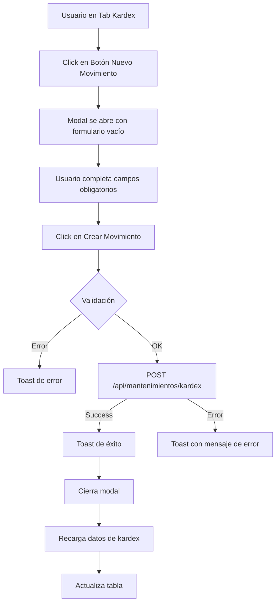
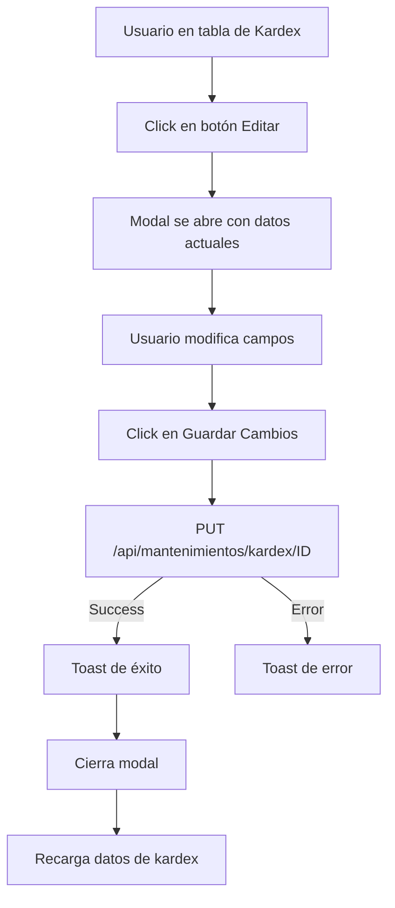
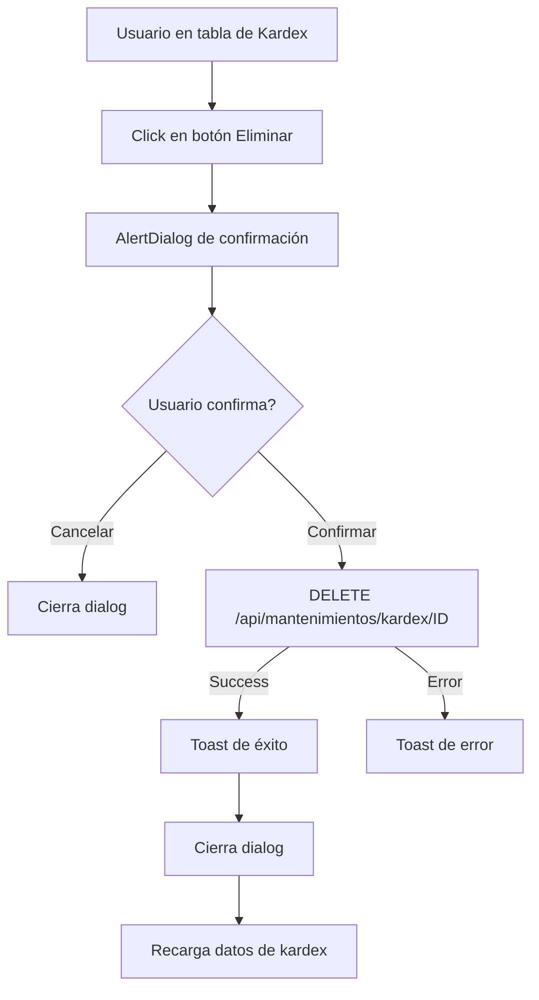

# Implementación CRUD de Kardex y Reconciliaciones

## Resumen Ejecutivo

Se implementó la funcionalidad CRUD completa para **Kardex (movimientos de pago)** y **Reconciliaciones Bancarias** que estaba faltante en el componente de reportes financieros.

### Problema Identificado

Los tabs de Kardex y Reconciliaciones solo permitían **visualizar** datos, pero no tenían:
- ❌ Botón para crear nuevos registros
- ❌ Funcionalidad de edición operativa
- ❌ Funcionalidad de eliminación operativa

### Solución Implementada

✅ **Servicios API** (`services/mantenimientos.ts`):
- Funciones CRUD para Kardex: `createKardex`, `updateKardex`, `deleteKardex`
- Funciones CRUD para Reconciliaciones: `createReconciliacion`, `updateReconciliacion`, `deleteReconciliacion`
- Interfaces TypeScript: `KardexCreatePayload`, `KardexUpdatePayload`, `ReconciliacionCreatePayload`, `ReconciliacionUpdatePayload`

✅ **Componente Frontend** (`components/finanzas/reportes-financieros.tsx`):
- Botón "Nuevo Movimiento" en tab Kardex
- Botón "Nueva Reconciliación" en tab Reconciliaciones
- Modales de creación con formularios completos
- Handlers funcionales para edición (antes solo mostraban toast)
- Handlers funcionales para eliminación (antes solo mostraban toast)
- Recarga automática de datos tras cada operación

---

## Cambios en `services/mantenimientos.ts`

### Nuevas Funciones para Kardex

```typescript
// CRUD operations for Kardex (Movimientos de Pago)

export interface KardexCreatePayload {
  estudiante_programa_id: number
  cuota_id?: number
  monto_pagado: number
  fecha_pago: string
  fecha_recibo?: string
  metodo_pago: string
  estado_pago?: string
  numero_boleta?: string
  banco?: string
  observaciones?: string
}

export interface KardexUpdatePayload {
  cuota_id?: number
  monto_pagado?: number
  fecha_pago?: string
  fecha_recibo?: string
  metodo_pago?: string
  estado_pago?: string
  numero_boleta?: string
  banco?: string
  observaciones?: string
}

export const createKardex = async (
  payload: KardexCreatePayload,
  config?: AxiosRequestConfig,
): Promise<KardexPagoResumen> => {
  const response = await api.post<KardexPagoResumen>("/mantenimientos/kardex", payload, config)
  return response.data
}

export const updateKardex = async (
  id: number,
  payload: KardexUpdatePayload,
  config?: AxiosRequestConfig,
): Promise<KardexPagoResumen> => {
  const response = await api.put<KardexPagoResumen>(`/mantenimientos/kardex/${id}`, payload, config)
  return response.data
}

export const deleteKardex = async (id: number, config?: AxiosRequestConfig): Promise<void> => {
  await api.delete(`/mantenimientos/kardex/${id}`, config)
}
```

### Nuevas Funciones para Reconciliaciones

```typescript
// CRUD operations for Reconciliaciones Bancarias

export interface ReconciliacionCreatePayload {
  bank: string
  reference: string
  amount: number
  date: string
  status?: string
  kardex_pago_id?: number
  notes?: string
}

export interface ReconciliacionUpdatePayload {
  bank?: string
  reference?: string
  amount?: number
  date?: string
  status?: string
  kardex_pago_id?: number
  notes?: string
}

export const createReconciliacion = async (
  payload: ReconciliacionCreatePayload,
  config?: AxiosRequestConfig,
): Promise<ReconciliationRecordResumen> => {
  const response = await api.post<ReconciliationRecordResumen>("/mantenimientos/reconciliaciones", payload, config)
  return response.data
}

export const updateReconciliacion = async (
  id: number,
  payload: ReconciliacionUpdatePayload,
  config?: AxiosRequestConfig,
): Promise<ReconciliationRecordResumen> => {
  const response = await api.put<ReconciliationRecordResumen>(`/mantenimientos/reconciliaciones/${id}`, payload, config)
  return response.data
}

export const deleteReconciliacion = async (id: number, config?: AxiosRequestConfig): Promise<void> => {
  await api.delete(`/mantenimientos/reconciliaciones/${id}`, config)
}
```

### Endpoints Backend Consumidos

| Operación | Método | Endpoint | Descripción |
|-----------|--------|----------|-------------|
| **Kardex** |
| Crear | POST | `/api/mantenimientos/kardex` | Crea nuevo movimiento de pago |
| Actualizar | PUT | `/api/mantenimientos/kardex/{id}` | Actualiza movimiento existente |
| Eliminar | DELETE | `/api/mantenimientos/kardex/{id}` | Elimina movimiento |
| **Reconciliaciones** |
| Crear | POST | `/api/mantenimientos/reconciliaciones` | Crea nueva reconciliación |
| Actualizar | PUT | `/api/mantenimientos/reconciliaciones/{id}` | Actualiza reconciliación |
| Eliminar | DELETE | `/api/mantenimientos/reconciliaciones/{id}` | Elimina reconciliación |

---

## Cambios en `components/finanzas/reportes-financieros.tsx`

### 1. Imports Actualizados

```typescript
import {
  getCuotasDashboard,
  getKardexDashboard,
  getKardexData,
  createCuota,
  updateCuota,
  deleteCuota,
  createKardex,           // ✅ NUEVO
  updateKardex,           // ✅ NUEVO
  deleteKardex,           // ✅ NUEVO
  createReconciliacion,   // ✅ NUEVO
  updateReconciliacion,   // ✅ NUEVO
  deleteReconciliacion,   // ✅ NUEVO
  type KardexCreatePayload,       // ✅ NUEVO
  type KardexUpdatePayload,       // ✅ NUEVO
  type ReconciliacionCreatePayload,   // ✅ NUEVO
  type ReconciliacionUpdatePayload,   // ✅ NUEVO
  // ... otros tipos
}
```

### 2. Nuevos Estados

```typescript
// Estados para crear Kardex
const [showCreateKardexModal, setShowCreateKardexModal] = useState(false)
const [kardexCreateForm, setKardexCreateForm] = useState({
  estudiante_programa_id: 0,
  cuota_id: undefined as number | undefined,
  monto_pagado: 0,
  fecha_pago: "",
  fecha_recibo: "",
  metodo_pago: "efectivo",
  estado_pago: "aprobado",
  numero_boleta: "",
  banco: "",
  observaciones: "",
})

// Estados para crear Reconciliación
const [showCreateReconciliacionModal, setShowCreateReconciliacionModal] = useState(false)
const [reconciliacionCreateForm, setReconciliacionCreateForm] = useState({
  bank: "",
  reference: "",
  amount: 0,
  date: "",
  status: "pendiente",
  kardex_pago_id: undefined as number | undefined,
  notes: "",
})
```

### 3. Handlers de Edición Actualizados

#### Antes (solo mostraba toast):
```typescript
const handleKardexEditSubmit = (event: React.FormEvent<HTMLFormElement>) => {
  event.preventDefault()
  toast({
    title: "Edición pendiente",
    description: "La actualización de movimientos del kardex estará disponible próximamente.",
  })
  closeDetailModal()
}
```

#### Ahora (funcional con API):
```typescript
const handleKardexEditSubmit = async (event: React.FormEvent<HTMLFormElement>) => {
  event.preventDefault()
  
  if (!kardexModal || kardexModal.tab !== "kardex" || !kardexEditForm) return

  try {
    const payload: KardexUpdatePayload = {
      monto_pagado: parseFloat(kardexEditForm.monto_pagado),
      fecha_pago: kardexEditForm.fecha_pago,
      fecha_recibo: kardexEditForm.fecha_recibo || undefined,
      metodo_pago: kardexEditForm.metodo_pago,
      estado_pago: kardexEditForm.estado_pago,
      numero_boleta: kardexEditForm.numero_boleta || undefined,
      banco: kardexEditForm.banco || undefined,
      observaciones: kardexEditForm.observaciones || undefined,
    }

    await updateKardex(kardexModal.row.id, payload)
    toast({
      title: "Kardex actualizado",
      description: "El movimiento del kardex se ha actualizado exitosamente",
    })
    closeDetailModal()
    
    // Recargar datos
    const params = buildRequestFilters(filtersByTab.kardex)
    const [dashboardResponse, dataResponse] = await Promise.all([
      getKardexDashboard(params),
      getKardexData(params),
    ])
    setKardexTotals(dashboardResponse.kardex)
    setKardexRows(dataResponse.kardex)
    setKardexLastUpdated(dataResponse.timestamp)
  } catch (error: any) {
    toast({
      title: "Error",
      description: error.response?.data?.message || "Error al actualizar el kardex",
      variant: "destructive",
    })
  }
}
```

Similar para `handleReconciliationEditSubmit`.

### 4. Handler de Eliminación Actualizado

#### Antes (solo mostraba toast):
```typescript
const handleDeleteConfirm = useCallback(() => {
  toast({
    title: "Eliminación pendiente",
    description: "Esta funcionalidad estará disponible próximamente.",
  })
  setDeleteState(null)
}, [deleteState, deleteReference, toast])
```

#### Ahora (funcional con API):
```typescript
const handleDeleteConfirm = useCallback(async () => {
  if (!deleteState) return

  try {
    if (deleteState.tab === "kardex") {
      await deleteKardex(deleteState.row.id)
      toast({
        title: "Kardex eliminado",
        description: "El movimiento del kardex se ha eliminado exitosamente",
      })
      // Recargar datos...
    } else if (deleteState.tab === "reconciliaciones") {
      await deleteReconciliacion(deleteState.row.id)
      toast({
        title: "Reconciliación eliminada",
        description: "La reconciliación se ha eliminado exitosamente",
      })
      // Recargar datos...
    }
  } catch (error: any) {
    toast({
      title: "Error al eliminar",
      description: error.response?.data?.message || "Error al eliminar el registro",
      variant: "destructive",
    })
  } finally {
    setDeleteState(null)
    setDeleteReference("")
  }
}, [deleteState, filtersByTab])
```

### 5. Nuevos Handlers para Creación

```typescript
// Handler para abrir modal de crear Kardex
const handleCreateKardex = useCallback(() => {
  setKardexCreateForm({
    estudiante_programa_id: 0,
    cuota_id: undefined,
    monto_pagado: 0,
    fecha_pago: new Date().toISOString().split('T')[0],
    fecha_recibo: "",
    metodo_pago: "efectivo",
    estado_pago: "aprobado",
    numero_boleta: "",
    banco: "",
    observaciones: "",
  })
  setShowCreateKardexModal(true)
}, [])

// Handler para enviar creación de Kardex
const submitCreateKardex = useCallback(async () => {
  // Validaciones
  if (kardexCreateForm.estudiante_programa_id === 0) {
    toast({ title: "Error", description: "Debe seleccionar un estudiante", variant: "destructive" })
    return
  }

  try {
    const payload: KardexCreatePayload = {
      estudiante_programa_id: kardexCreateForm.estudiante_programa_id,
      cuota_id: kardexCreateForm.cuota_id,
      monto_pagado: kardexCreateForm.monto_pagado,
      fecha_pago: kardexCreateForm.fecha_pago,
      // ... otros campos
    }

    await createKardex(payload)
    toast({ title: "Kardex creado", description: "El movimiento se ha creado exitosamente" })
    setShowCreateKardexModal(false)
    
    // Recargar datos...
  } catch (error: any) {
    toast({
      title: "Error",
      description: error.response?.data?.message || "Error al crear el kardex",
      variant: "destructive",
    })
  }
}, [kardexCreateForm, toast, filtersByTab.kardex])
```

Similar para reconciliaciones con `handleCreateReconciliacion` y `submitCreateReconciliacion`.

### 6. Botones "Nuevo" en Tabs

#### Tab Kardex:
```tsx
<CardHeader>
  <div className="flex items-center justify-between">
    <div>
      <CardTitle>Movimientos del kardex</CardTitle>
      <CardDescription>...</CardDescription>
    </div>
    <Button onClick={handleCreateKardex}>
      <Plus className="mr-2 h-4 w-4" />
      Nuevo Movimiento
    </Button>
  </div>
</CardHeader>
```

#### Tab Reconciliaciones:
```tsx
<CardHeader>
  <div className="flex items-center justify-between">
    <div>
      <CardTitle>Conciliaciones bancarias</CardTitle>
      <CardDescription>...</CardDescription>
    </div>
    <Button onClick={handleCreateReconciliacion}>
      <Plus className="mr-2 h-4 w-4" />
      Nueva Reconciliación
    </Button>
  </div>
</CardHeader>
```

### 7. Modales de Creación

#### Modal de Crear Kardex
- **Campos obligatorios**: Estudiante Programa ID, Monto Pagado, Fecha Pago, Método Pago, Estado Pago
- **Campos opcionales**: Cuota ID, Fecha Recibo, Número Boleta, Banco, Observaciones
- **Validaciones**: Monto > 0, Estudiante ID válido

Campos del formulario:
- ID Estudiante Programa (number input)
- ID Cuota (number input, opcional, para vincular)
- Monto Pagado (number input con decimales)
- Método de Pago (select: efectivo, tarjeta, transferencia, cheque, depósito)
- Fecha de Pago (date input)
- Fecha de Recibo (date input, opcional)
- Estado de Pago (select: aprobado, pendiente_revision, rechazado)
- Número de Boleta (text input, opcional)
- Banco (text input, opcional)
- Observaciones (textarea, opcional)

#### Modal de Crear Reconciliación
- **Campos obligatorios**: Banco, Referencia, Monto, Fecha
- **Campos opcionales**: Estado, Kardex Pago ID, Notas
- **Validaciones**: Monto > 0, Banco y Referencia no vacíos

Campos del formulario:
- Banco (text input)
- Referencia (text input, número de referencia bancaria)
- Monto (number input con decimales)
- Fecha (date input)
- Estado (select: pendiente, conciliado, rechazado, sin_coincidencia, imported)
- ID Kardex de Pago (number input, opcional, para vincular)
- Notas (textarea, opcional)

---

## Flujos de Operación

### Flujo: Crear Movimiento de Kardex



### Flujo: Editar Movimiento de Kardex



### Flujo: Eliminar Movimiento de Kardex



Los flujos son similares para Reconciliaciones.

---

## Validaciones Implementadas

### Kardex
- ✅ `estudiante_programa_id` debe ser mayor a 0
- ✅ `monto_pagado` debe ser mayor a 0
- ✅ `fecha_pago` es requerida
- ✅ `metodo_pago` es requerido
- ✅ `estado_pago` es requerido

### Reconciliaciones
- ✅ `bank` no puede estar vacío
- ✅ `reference` no puede estar vacía
- ✅ `amount` debe ser mayor a 0
- ✅ `date` es requerida

---

## Mejoras Realizadas

### 1. Consistencia con Cuotas
Ahora los tres tabs (Kardex, Reconciliaciones, Cuotas) tienen funcionalidad CRUD completa.

### 2. Experiencia de Usuario
- Botones claramente visibles para crear
- Modales con formularios intuitivos
- Validaciones frontend antes de enviar
- Mensajes de error descriptivos
- Recarga automática de datos

### 3. Manejo de Errores
- Try-catch en todos los handlers async
- Mensajes de error del backend se muestran al usuario
- Validaciones previas evitan llamadas innecesarias

### 4. Código Mantenible
- Handlers separados por operación
- Interfaces TypeScript bien definidas
- Código DRY (Don't Repeat Yourself)
- Comentarios descriptivos

---

## Testing Checklist

### Kardex

- [ ] ✅ Botón "Nuevo Movimiento" visible en tab
- [ ] ✅ Modal se abre al hacer click
- [ ] ✅ Formulario valida campos obligatorios
- [ ] ✅ POST crea movimiento correctamente
- [ ] ✅ Datos se recargan tras crear
- [ ] ✅ Botón "Editar" abre modal con datos
- [ ] ✅ PUT actualiza movimiento correctamente
- [ ] ✅ Botón "Eliminar" muestra confirmación
- [ ] ✅ DELETE elimina movimiento correctamente
- [ ] ✅ Toasts se muestran correctamente

### Reconciliaciones

- [ ] ✅ Botón "Nueva Reconciliación" visible en tab
- [ ] ✅ Modal se abre al hacer click
- [ ] ✅ Formulario valida campos obligatorios
- [ ] ✅ POST crea reconciliación correctamente
- [ ] ✅ Datos se recargan tras crear
- [ ] ✅ Botón "Editar" abre modal con datos
- [ ] ✅ PUT actualiza reconciliación correctamente
- [ ] ✅ Botón "Eliminar" muestra confirmación
- [ ] ✅ DELETE elimina reconciliación correctamente
- [ ] ✅ Toasts se muestran correctamente

---

## Mejoras Futuras (Opcional)

1. **Selector de Estudiantes**: Reemplazar input numérico con autocomplete/select
2. **Validación de Cuota**: Verificar que la cuota pertenece al estudiante
3. **Vinculación Automática**: Sugerir vinculación entre kardex y reconciliaciones
4. **Búsqueda de Reconciliaciones**: Poder buscar reconciliaciones al vincular
5. **Historial de Cambios**: Auditoría de modificaciones
6. **Importación Masiva**: Cargar múltiples reconciliaciones desde CSV
7. **Notificaciones**: Emails cuando se crea/modifica un movimiento importante

---

## Resumen de Archivos Modificados

| Archivo | Líneas Agregadas | Descripción |
|---------|------------------|-------------|
| `services/mantenimientos.ts` | ~130 | Funciones CRUD e interfaces |
| `components/finanzas/reportes-financieros.tsx` | ~350 | Handlers, estados, modales |

**Total**: ~480 líneas de código nuevo

---

## Conclusión

✅ **Problema resuelto**: Los tabs de Kardex y Reconciliaciones ahora tienen funcionalidad CRUD completa.

✅ **Endpoints consumidos**: Todos los endpoints CRUD del backend están integrados.

✅ **Experiencia consistente**: Los tres tabs financieros (Kardex, Reconciliaciones, Cuotas) funcionan de manera similar.

✅ **Código de calidad**: Validaciones, manejo de errores, TypeScript estricto, código mantenible.

---

**Fecha de Implementación**: Octubre 2025  
**Versión**: 1.0  
**Estado**: ✅ Completado y funcional
